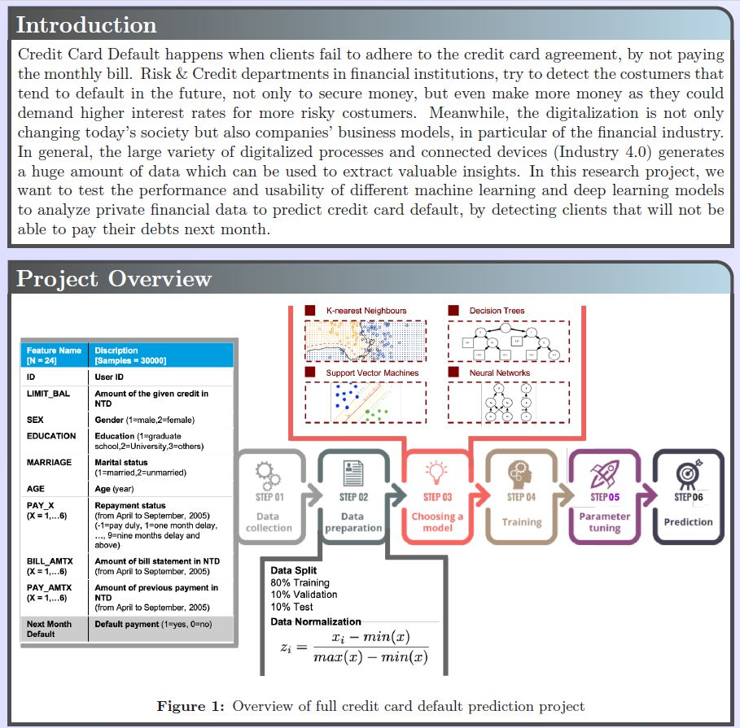
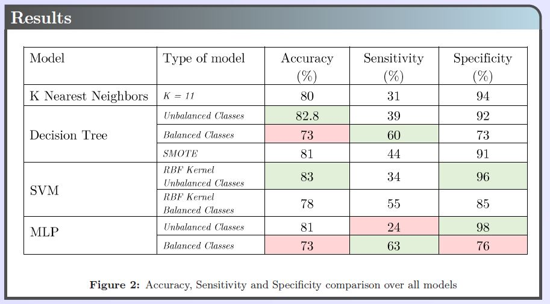

# fintech-2019
||||
|:---:|:---:|:--:|

Different machine learning and deep learning projects with their reports related to financial technology.

#### 1) [Linear regression](linear_regression)
#### 2) [Deep Neural Network](dnn)
#### 3) [Convolutionnal Neural Network](cnn)
#### 4) [Recurent Neural Networks](linear_regression)

#### ( Final ) [_Credit Card Default Prediction_](final_credit_cart_default_detection/final_poster.pdf)

